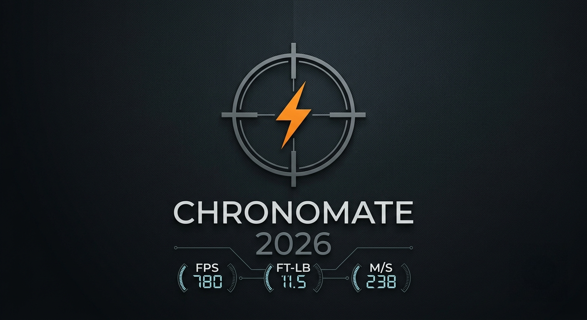

# ChronoMate 2026

### Lightweight, offline chronograph recording software for air rifles.

---

## Overview

ChronoMate 2026 is a lightweight desktop application for recording air rifle chronograph sessions.

Designed to be simple, fast and completely offline, ChronoMate allows you to record shot strings, calculate muzzle energy, manage rifle and pellet information, and generate professional printable reports.

No installation is required. Simply extract the release archive and open **ChronoMate.html** using a supported desktop browser.

---

## Key Features

- Lightweight and portable
- Runs completely offline
- No installation required
- Professional printable reports
- Automatic ft-lb and Joule calculations
- Supports FPS and m/s
- Built-in pellet database
- User pellet database
- Saved rifle profiles
- Portable Backup & Restore
- Light and Dark themes

---

## Design Philosophy

ChronoMate has been designed around one simple principle:

> **If a feature does not improve the recording, reporting or management of chronograph sessions, it does not belong in the application.**

The aim is to remain lightweight, fast, easy to use and easy to maintain without unnecessary complexity.

---

## Documentation

Full documentation is included with the project.

- Installation Guide
- User Guide
- Backup & Restore
- Frequently Asked Questions
- Changelog

Documentation can be found in the **docs** folder.

---

## System Requirements

Tested on:

- Windows 10
- Windows 11

Supported browsers:

- Mozilla Firefox
- Microsoft Edge
- Brave Browser

ChronoMate is designed for desktop browsers.

Android and iOS local file execution are not currently supported due to mobile operating system restrictions.

---

## Project Status

ChronoMate is feature complete.

Future releases will focus on:

- Documentation improvements
- Built-in pellet database expansion
- Bug fixes
- Long-term maintenance

New functionality will only be added where it clearly improves the recording, reporting or management of chronograph sessions while preserving ChronoMate's lightweight design philosophy.

---

## Credits

Designed and Developed by

**Chris Bruce**
(CBDesignS)

Developed in collaboration with

**OpenAI ChatGPT**

---

## License

ChronoMate 2026 is distributed under the MIT License.

See the LICENSE file for details.
